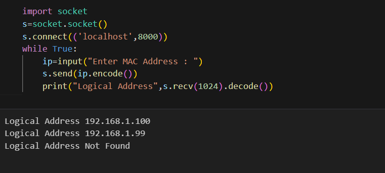

# EX-5 IMPLEMENTATION OF REVERSE ADDRESS RESOLUTION PROTOCOL ( RARP )

DATE :05-04-2023

## AIM :

To write a python program for simulating RARP protocols using UDP.

## ALGORITHM :

### Client:
1. Start the program
2. Using datagram sockets UDP function is established.
3. Get the MAC address to be converted into IP address.
4. Send this MAC address to server.
5. Server returns the IP address to client.
### Server:
1. Start the program.
2. Server maintains the table in which IP and corresponding MAC addresses are stored.
3. Read the MAC address which is send by the client.
4. Map the IP address with its MAC address and return the IP address to client.

## PROGRAM :

### Client:
```
import socket
s=socket.socket()
s.bind(('localhost',8000))
s.listen(5)
c,addr=s.accept()
address={"6A:08:AA:C2":"192.168.1.100","8A:BC:E3:FA":"192.168.1.99"};
while True:
    ip=c.recv(1024).decode()
    try:
        c.send(address[ip].encode())
    except KeyError:
        c.send("Not Found".encode()) 
```
### Server:
```
import socket
s=socket.socket()
s.connect(('localhost',8000))
while True:
    ip=input("Enter MAC Address : ")
    s.send(ip.encode())
    print("Logical Address",s.recv(1024).decode())
```

## OUTPUT :

### Client:


### Server:


## RESULT :
Thus, python program for simulating RARP protocols using UDP was successfully executed.
